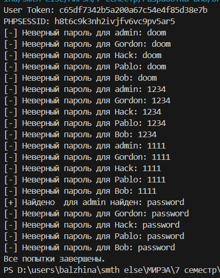
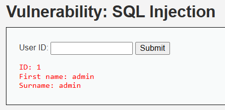

# password-reseller-BruteForceDVWA
password reseller for the form in the Bruteforce task on the dva.local website


### 1. Необходимо разработать переборщик паролей для формы в задании Bruteforce на сайте dvwa.local (Можно использовать официальный ресурс или виртуальную машину Web Security Dojo) 




Получение пользователей



### 2. Проанализировать код и сделать кодревью, указав слабые места. Слабость уязвимого кода необходимо указать с использованием метрики CWE (база данных cwe.mitre.org)


Предоставленный фрагмент кода PHP содержит несколько уязвимостей, которые можно проанализировать с помощью показателей общего перечисления слабых мест (CWE). Ниже приведен подробный обзор кода, в котором выделены слабые места и соответствующие им идентификаторы CWE.

#### Обзор кода

1. Уязвимость SQL-инъекции
   - Слабое место: Код создает SQL-запрос, используя пользовательский ввод напрямую, без надлежащей очистки или подготовленных инструкций. Это делает его уязвимым для атак с использованием SQL-инъекций, когда злоумышленник может манипулировать SQL-запросом, вводя вредоносные данные.
   - Идентификатор CWE: CWE-89: SQL-инъекция
   - Рекомендация: Используйте подготовленные инструкции с параметризованными запросами вместо прямого встраивания пользовательского ввода в SQL-запросы.

   ```php
   $stmt = $mysqli->подготовить("ВЫБЕРИТЕ * ИЗ "пользователи", ГДЕ пользователь = ? И пароль =?");
   $stmt->bind_param("ss", $user, $pass);
   $stmt->выполнить();
   

2. **Уязвимость хранилища паролей**
   - **Слабое место**: Код использует MD5 для хеширования паролей, что считается небезопасным из-за его уязвимости к коллизионным атакам и быстрому вычислению, что делает его уязвимым для атак методом перебора.
   - **Идентификатор CWE**: CWE-916: Использование хэша пароля с недостаточными вычислительными затратами
   - **Рекомендация**: Используйте более надежный алгоритм хэширования, такой как `password_hash()` в PHP, который по умолчанию реализует bcrypt.

   ```php
   $pass = password_hash($pass, PASSWORD_DEFAULT);
   

3. Уязвимость при обработке ошибок
   - **Слабое место**: Код отображает подробные сообщения об ошибках из запроса к базе данных непосредственно пользователю. Это может привести к раскрытию конфиденциальной информации о структуре базы данных и потенциально помочь злоумышленнику в подготовке дальнейших атак.
   - Идентификатор CWE: CWE-209: Предоставление информации посредством сообщения об ошибке
   -  Рекомендация: Регистрируйте ошибки внутри системы и отображайте общее сообщение об ошибке для пользователя.

    ```php
    if (!$результат) {
        error_log(mysqli_error($GLOBALS["___mysqli_ston"])); // Ошибка внутреннего журнала
        $html .= "<pre><br />Неверное имя пользователя и/или пароль.</pre>"; // Общее сообщение
    }
   
4. **Риск межсайтового скриптинга (XSS)**
   - **Слабое место**: выходные данные включают пользовательские данные ("$user" и "$avatar") напрямую, без очистки. Это может позволить злоумышленнику внедрять вредоносные скрипты, если они контролируют вводимые данные.
   - **Идентификатор CWE**: CWE-79: Неправильная нейтрализация вводимых данных при создании веб-страницы ("Межсайтовый скриптинг")
   - **Рекомендация**: При рендеринге пользовательских данных обработайте вывод с помощью таких функций, как `htmlspecialchars()`.

   ```php
   $html .= "<p>Добро пожаловать в область, защищенную паролем " . htmlspecialchars($user) . "</p>";
   

5.  Использование глобальной переменной
   - **Слабое место**: В коде используется "$GLOBALS["___mysqli_ston"]", что не является хорошей практикой, поскольку оно основано на глобальных переменных, которые могут привести к непредсказуемому поведению и усложнить поддержку кода.
   - Идентификатор CWE: CWE-704: Неверное преобразование типа или приведение к нему значений
   - Рекомендация: Используйте локальные переменные для подключений к базе данных вместо того, чтобы полагаться на глобальные переменные.


### 3. Разработать свою систему авторизации на любом языке, исключающий взможность подбора паролей разработнным переборщиком паролей в задании 1. Возможно исправление авторизации из dvwa.local *Требования к системе авторизации*
   - Система авторизации должна использовать запросы GET с параметрами, аналогичными из задания bruteforce dvwa

    dvwa.local/vulnerabilities/brute/?username=USER&password=PASS&user_token=TOKEN&Login=Login

    
**newLogin.py**

**Описание работы системы** 

 1. Логика токена:
 
    • На страницу входа (/login) пользователь получает уникальный токен (user_token).
    
    • Токен действителен только для текущей сессии и истекает после использования.
    
 2. Ограничение попыток:
 
     • Используется rate_limiter, чтобы заблокировать IP-адрес после 5 попыток в течение минуты.
 
 3. Хранение паролей:
 
    • Пароли хранятся в хешированном виде с использованием werkzeug.security.
 
 4. Пример запросов:
 
    • Получение токена:

        GET /login Response: { "user_token": "random_token" }

    • Попытка входа:

        GET /vulnerabilities/brute/?username=admin&password=wrongpass&user_token=random_token&Login=Login
        Response: { "error": "Invalid credentials." }

 5. Защита от брутфорса:

    • Блокировка IP при превышении лимита запросов.

    • Проверка уникального токена на каждую попытку.